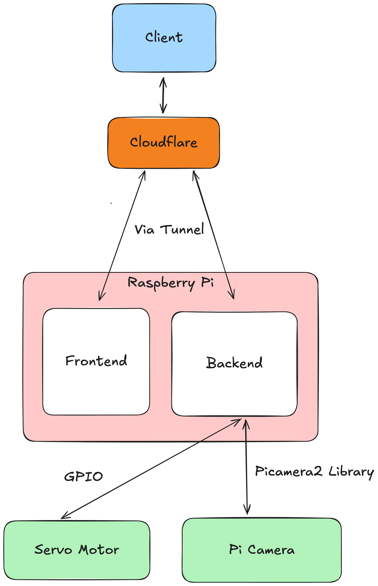

# 🐾 Pup Portal

Pup Portal is a web app built to run on a Raspberry Pi to power a smart dog feeder. My family and I can log on to the app from anywhere to view a live video feed from the dispenser and control the dispenser to dispense food to our golden retriever Bauer.

## Demo
https://github.com/user-attachments/assets/4c376c14-135b-48e9-876c-1a9c82fee5c2

## How it works

### Backend

* FastAPI
* PiCamera2
* RPi.GPIO
* PyJWT

### Frontend

* React
* TypeScript
* Tailwind CSS
* Vite

### Hardware

* Raspberry Pi 4B
* Camera Module 2
* SG90 Micro Servo Motor

