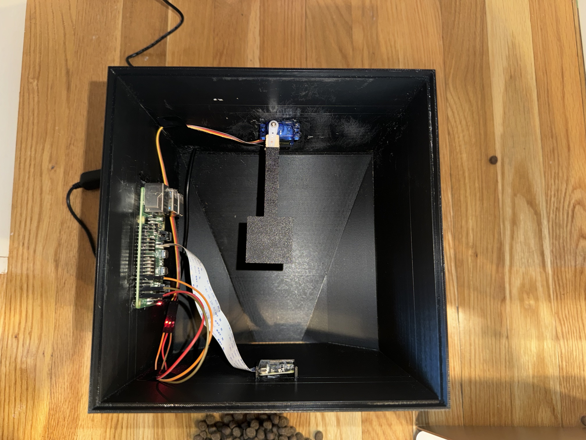

# 🐾 Pup Portal

Pup Portal is a web app built to run on a Raspberry Pi to power a smart dog feeder. User's (my family) can log on to the app to view a live video feed from the dispenser and control the dispenser to dispense food to their dog (my golden retriever Bauer).

## Demo

## Dispenser Internals

